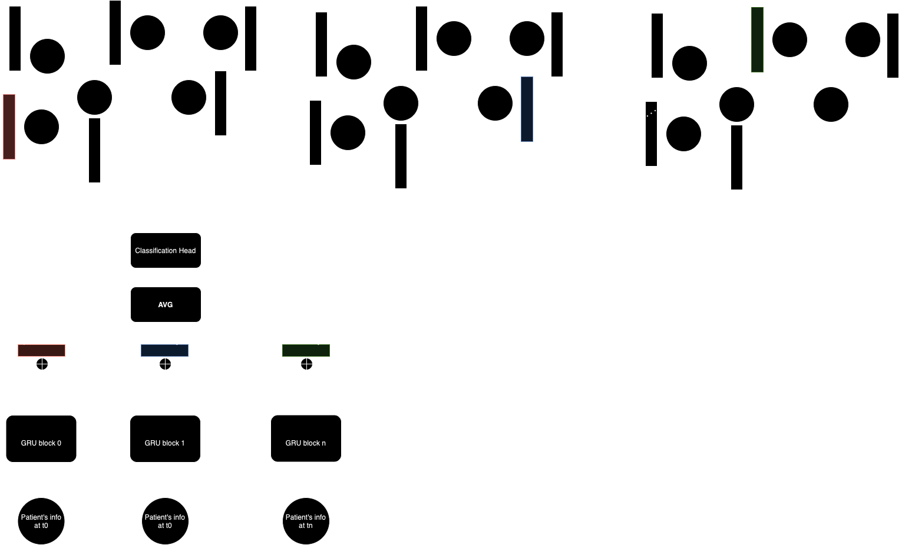

# Spatio temporal timeseries analysis

## Results 
| Model                  | Accuracy        | F1-Score        |
| -----------------------| --------------- | --------------- |
| HeteroGNN              | 0.5773 +- 0.013 | 0.4226 +- 0.039 |
| Semi-decoupled RNN+GNN | 0.7896 +- 0.032 | 0.7535 +- 0.045 |
| Totally decoupled      | 0.7146 +- 0.149 | 0.7158 +- 0.152 |